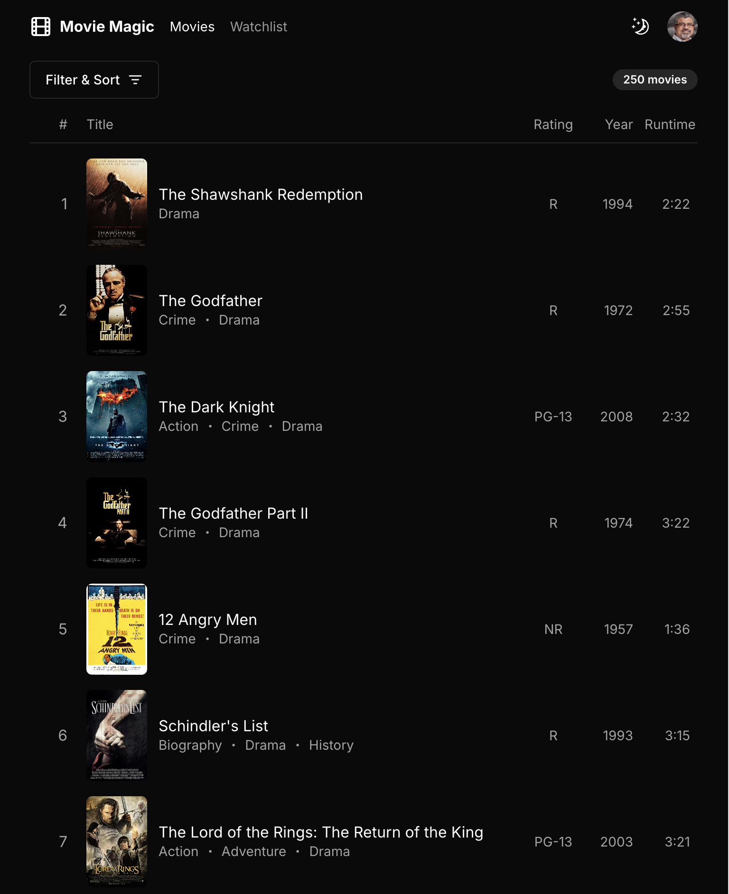

# Movie Magic AI

This repository implements Movie Magic using various AI assistants. For a
completely manual implementation, please see the
[original repository](https://github.com/code-shaper/movie-magic) and the
[live demo](https://movie-magic-ultimate.vercel.app/).

Movie Magic is a contrived, but realistic movie streaming app that allows the
user to browse and filter movies so they can add them to their watchlist. For
every implementation, we provided a hand-sketched wireframe to the AI assistant
to get it started.


We then iterated on the implementation, providing feedback and guidance to the
AI assistant to shoot for the following visual design:



Please follow the links below for detailed evaluations:

1. [Movie Magic using ChatGPT 4o](apps/movie-magic-chatgpt/)
2. [Movie Magic using Claude](apps/movie-magic-claude/)
3. [Movie Magic using Claude - v2](apps/movie-magic-claude-v2/) (input is hi-def
   visual design)
4. [Movie Magic using Vercel v0](apps/movie-magic-v0/)
5. [Movie Magic using Devin](apps/movie-magic-devin/)

## Prerequisites for development

1. [Node Version Manager](https://github.com/nvm-sh/nvm) (nvm) - allows using
   different versions of node via the command line

## Getting Started

```shell
nvm use        # use the required version of node
npm ci         # install dependencies
npm run build  # build all packages
npm run dev    # run apps
```

Open browser windows at the following URLs to see the respective apps:

1. http://localhost:3000/: Movie Magic using ChatGPT 4o
2. http://localhost:3001/: Movie Magic using Claude
3. http://localhost:3002/: Movie Magic using Claude - v2 (input is hi-def visual
   design)
4. http://localhost:3003/: Movie Magic using Vercel v0
5. http://localhost:3004/: Movie Magic using Devin

> Note: Do not run `npm install` or `npm ci` in any of the subdirectories. It
> will break the build. There should be only one `package-lock.json` file in the
> entire repo (at the root).

## All Commands

```
npm ci                   # install dependencies
npm run build            # builds all workspaces
npm run ci-validate      # builds, lints, formats, and tests all code (runs in CI pipeline, don't run locally)
npm run clean            # deletes all build artifacts
npm run commit           # displays commit helper prompt to ensure your commits use conventional commits
npm run dev              # run app
npm run fix              # lints, formats and attempts to fix any issues (requires `npm run build` has been ran)
npm run format           # formats all workspaces, useful for debugging format issues (generally `npm run fix` is preferred)
npm run lint             # runs the linter on all workspaces, useful for debugging lint issues (generally `npm run fix` is preferred)
npm run storybook        # runs storybook
npm run test             # runs full build, lint, format, and all tests - run before pushing to remote
```

## Common Workflows

### Creating New Components

Use [Code Shaper](https://www.code-shaper.dev/) to create new components. This
will give you a good starting point that is consistent with React best
practices.

Here's an example of creating a component called `EventList` using Code Shaper:

```sh
$ npx shaper
? Which plugin would you like to run? React (@code-shaper/react - generates React applications)
? Which generator would you like to run? component (generates a component)
? Component name? (e.g. TextField) EventList
? Which workspace should this go to? apps/movie-magic-ai
? Parent directory within workspace? src/components/EventList

Creating EventList...
  EventList.stories.tsx
  EventList.test.tsx
  EventList.tsx
  index.ts

Done.
```

### Production build

To build all packages and apps for production, run the following command:

```shell
npm ci
npm run build
```

### Clean build

Removes all build artifacts and performs a clean build. Run these steps before
pushing to remote.

```shell
npm run clean
nvm use
npm ci
npm run build
npm run fix
npm test
```

For an "aggressive" clean build, add a step to remove the `package-lock.json`
file as shown below. This will build the lock file from scratch.

```shell
npm run clean
nvm use
rm package-lock.json
npm install
npm run build
npm run fix
npm test
```

### Running unit tests

The following command runs a full build, lint, format, and all tests. However,
it uses the Turborepo cache to skip steps that have no changes since the last
run. Hence it is very efficient. **Always run this command before pushing to
remote.**

```shell
npm test
```

### Running end-to-end tests using dev build

```shell
npm run dev # starts a local server hosting the react app

# run e2e tests non-interactively (run in a different shell)
npm run e2e

# run e2e tests in the Playwright user interface (run in a different shell)
npm run e2e:ui
```

### Linting, formatting and fixing coding issues

```shell
npm run fix
```
