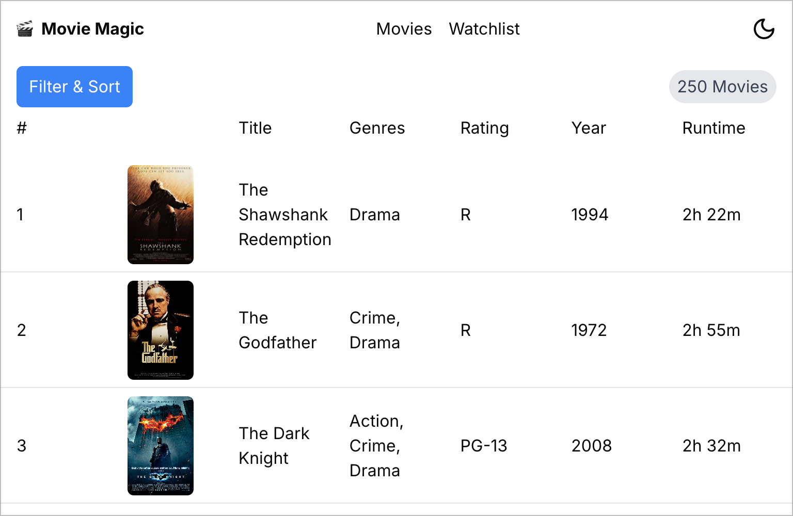
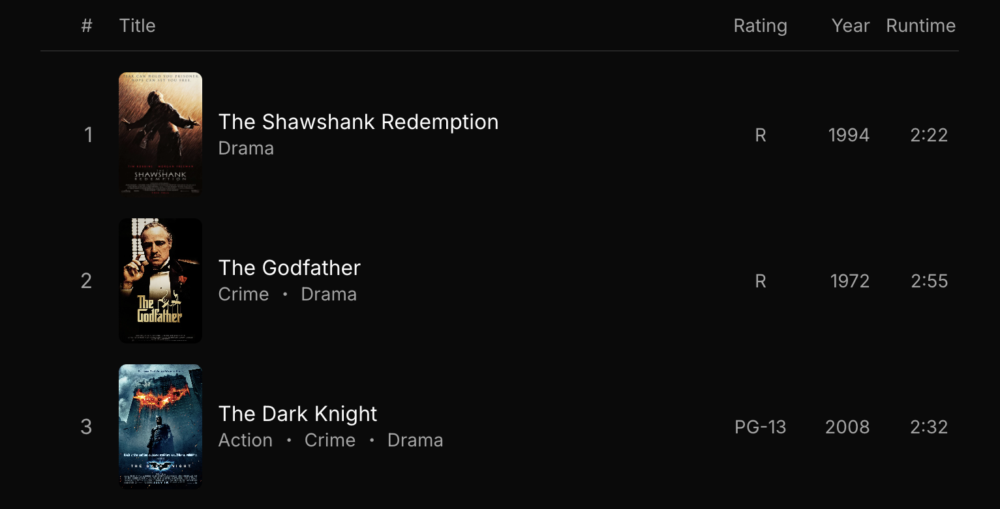
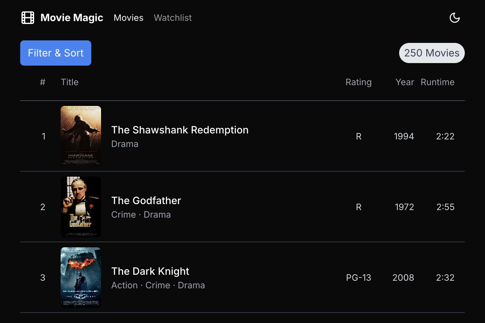
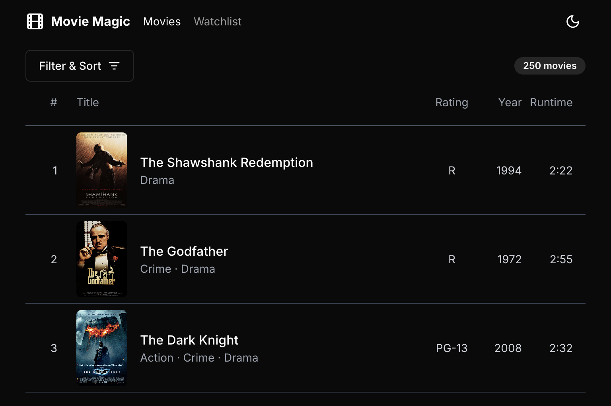

# Movie Magic ChatGPT 4o

These are my notes from implementing Movie Magic using ChatGPT 4o.

## Development Log

### Explain Requirements to ChatGPT

I started with a detailed conversation with ChatGPT, explaining the requirements
for Movie Magic. This conversation lasted about two hours, involving
explanations of the application's functionality, reviewing its understanding,
and providing clarifications and feedback to get the requirements right. You can
review the details in the ChatGPT Session Transcript, but here's a high-level
summary:

1. **Prompt (along with the hand-sketched wireframe):**
   - "You are a front-end developer with 20 years of experience in building web
     applications. Give me a detailed description of what's in this wireframe."
   - **Response:** ChatGPT provided a detailed understanding of the wireframe,
     breaking it down into three sections: (a) Header, (b) Main Content Area,
     (c) Movie List Table. The details were a bit sketchy, so I had to give it
     some help.
2. **Prompt:**
   - "Breakdown the page into three sections: (a) Header, (b) Toolbar
     (containing the Filter & Sort button + the Total Movies badge), (c) Movie
     List." I then described each section in more detail.
   - **Response:** ChatGPT provided an updated description of the wireframe with
     my specified changes, but the specs were still not tight enough, so I gave
     it more hints.
3. **Prompt:**
   - "The movie image should have an aspect ratio of 2/3. Heights of the various
     sections should be as follows: Header: 56px, Toolbar: 56px, Movie List
     Header: 39px, Movie List entry: 112px."
   - **Response:** ChatGPT updated the description with my specified changes.
4. **Prompt:**
   - "Add specific requirements for the technology stack: TypeScript, Next.js
     (use App Router, not the old Page Router), Tailwind CSS, shadcn/ui, Radix
     UI. Ask me any clarifying questions about this stack."
   - **Response:** ChatGPT asked six clarifying questions, such as "Next.js: Is
     there a preference for server-side rendering (SSR) or static site
     generation (SSG) for specific parts of the application?"
5. **Prompt:**
   - I answered all the questions in detail, e.g., "For Next.js, do not use SSR
     or SSG. Instead, use React Server Components (RSC) and React Client
     Components."

This process went on until I was fully satisfied with the requirements. At that
point, I asked ChatGPT to generate the code. It generated decent code, along
with setup instructions. Unfortunately, the setup instructions were very
haphazard, as ChatGPT had copied instructions from Next.js, Tailwind CSS, and
shadcn/ui without integrating them into a meaningful whole. I discarded them
completely and used
[Code Shaper](https://www.code-shaper.dev/docs/getting-started/create-a-new-repo)
to generate my starter app.

The generated code was reasonably modular, with the movies page at
`/src/app/movies/page.tsx` and the three sections in three separate components
under the `_components` folder. However, the code was not immediately
compilable! ChatGPT makes no attempt to compile the code it generates, resulting
in minor issues all over the place. The developer must step in to create a
working app. That's exactly what I did in iteration 1.

### Iteration 1 - Clean up generated code

After ironing out all the compilation issues, the visual design was still off.
Despite specific instructions, ChatGPT did not use any shadcn/ui components to
give the UI a polished look. Light/dark mode was not implemented, and movie
entries didn't include the provided images. I had to provide the exact code to
render the image in a 2/3 aspect ratio.

### Iteration 2 - Add shadcn/ui

Given that ChatGPT did not understand shadcn/ui, and the visual design was way
off, I made several manual changes to make the app look halfway decent (see
[this commit](https://github.com/nareshbhatia/movie-magic-ai/commit/e6eb6579f4cc36d6cc4094f0fa5317d74c289e38)
for the effort involved):

- Added shadcn/ui
- Added light/dark mode
- Included the correct logo from Lucide icons
- Cleaned up the header layout
- Added basic responsive behavior

### Iteration 3 - Improve Movie List

Next, I aimed to improve the layout of the Movie List. I provided ChatGPT with a
screenshot of the Movie List from my manual implementation along with precise
column widths, text justifications, and the desired responsive behavior.

 _Visual design of Movie List
supplied to ChatGPT_

ChatGPT did a pretty good job with this. It used grid layout to create precise
column widths and implemented the responsive specs, though it messed up a
little. I tweaked the generated code to get the desired results.

### Iteration 4 - Improve Toolbar

Finally, I worked on improving the Toolbar. Similar to iteration 3, I supplied
ChatGPT with a screenshot of the Toolbar from my manual implementation along
with the specifications of the shadcn/ui components that I wanted to use.

 _Visual design of Toolbar supplied to
ChatGPT_

ChatGPT followed the instructions but did not fully understand them. For
instance, it treated shadcn/ui as a library and created an import like
`import { Button } from 'shadcn/ui'`. Again, I tweaked the generated code to
make it work.

This is very close to my manual implementation. Of course, it gets us only the
visual look. The functionality is still missing, such as fetching data from a
server and the filters not working. I stopped here with ChatGPT because I had a
good idea of its capabilities.

## Summary of Major Issues

- **Cumbersome workflow:** ChatGPT operates outside my IDE, making it cumbersome
  to use. Each time I provide feedback, ChatGPT regenerates the entire project,
  which is slow. I then have to manually synchronize my code with the newly
  generated code, which is inefficient.
- **Non-compilable code:** ChatGPT does not compile the generated code,
  resulting in minor issues everywhere. The developer must fix these issues
  before having a working app.
- **Haphazard setup instructions:** ChatGPT copied setup instructions from
  Next.js, Tailwind CSS, and shadcn/ui without integrating them. I used
  [Code Shaper](https://www.code-shaper.dev/docs/getting-started/create-a-new-repo)
  to generate my starter app instead.
- **shadcn/ui not utilized:** ChatGPT did not understand shadcn/ui and
  reiterated my instructions without using components like `<Button>` in the
  code.
- **Light/dark mode not implemented:** ChatGPT provided placeholder buttons for
  light/dark mode but did not implement it.
- **Missing user avatar & dropdown menu:** This feature was completely missed.
- **Lack of understanding of Next.js and React Server Components:** Components
  using hooks and event handlers were created as server components instead of
  client components.

## Nit Picks

- **Directory structure:** Despite instructions, ChatGPT initially placed pages
  under `/pages` instead of `/app`. I had to guide it to use the App Router
  structure.
- **Absolute imports:** ChatGPT initially used long relative imports. I
  instructed it to use absolute imports for simplicity.
- **Component structure:** ChatGPT generated all components as arrow functions.
  After feedback, it converted them to function declarations.
- **Movie images:** Initial iterations did not include movie images. I had to
  instruct ChatGPT to use them and provide the exact `` element required.

## Conclusion

Even with extensive guidance, ChatGPT does not fully understand the intricacies
of web technologies like React Server Components and shadcn/ui. While the
generated code serves as a good starting point, it does not compile, and the
developer must fix numerous issues. The initial result is not polished, missing
many requirements, necessitating further dialogue with ChatGPT to meet
specifications. In many cases, I found it faster to code certain parts myself
rather than teaching ChatGPT.
