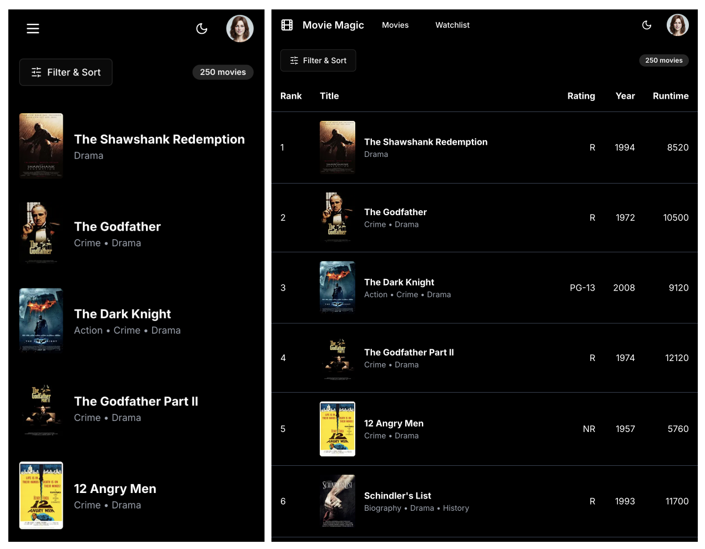

# Movie Magic using Claude (v2)

This is a variation on implementing Movie Magic using
[Claude](https://www.anthropic.com/claude). As we’ll know, LLMs perform better
with improved prompting. I decided to see how Claude would do with high-fidelity
visual designs as prompts vs. wireframes. I supplied two visual designs – one
for mobile form factor and another for desktop form factor. Here’s the resulting
implementation for the two form factors:



As you can see, Claude was able to implement the responsive behavior, however
its implementation was not up to the mark. Instead of using Tailwind's
responsive variants, it used a React hook with separate components for mobile
vs. desktop form factors. This is not a good practice unless the layouts are
completely different.

```tsx
export function MovieList({ movies }: MovieListProps) {
  const isMobile = useMediaQuery({ query: '(max-width: 639px)' });

  return (
    <div className="bg-black text-white">
      {isMobile ? (
        <MobileMovieList movies={movies} />
      ) : (
        <DesktopMovieList movies={movies} />
      )}
    </div>
  );
}
```

Moreover, the implementation does not meet the visual design specs. The toolbar
was 72px tall instead of 56px. The movie items were variable height (124-132px)
instead of 112px tall. When I prompted Claude to fix these heights, it simply
added `h-14` & `h-28` to these elements without ensuring that the constraints
were actually met. This indicates that Claude understood the instructions but it
does not have mastery over CSS to produce accurate results.
