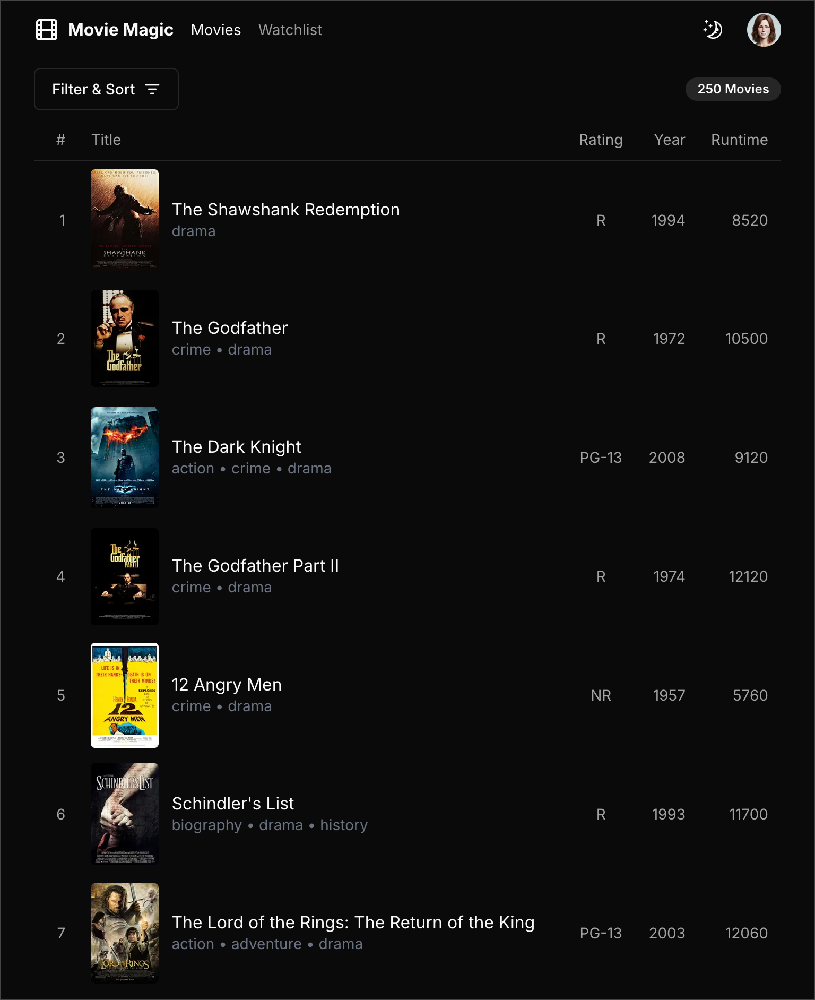

# Movie Magic using Claude

These are my notes from implementing Movie Magic using
[Claude](https://www.anthropic.com/claude), an AI-powered development assistant.

## Table of Contents

- [Development Log](#development-log)
  - [Prompting Claude to Generate Movie Magic](#prompting-claude-to-generate-movie-magic)
  - [Manually Iterating on Claude's Code](#manually-iterating-on-claudes-code)
- [Claude – Overall Impressions](#claude--overall-impressions)
- [Conclusion](#conclusion)

## Development Log

Describe Artifacts.

### Prompting Claude to Generate Movie Magic

### Manually Iterating on Claude's Code

### Iteration 1: Copy code from Claude

The code generated by Claude was well modularized and fairly clean. I was able
to get it up and running in no time. Here's a snapshot of the app without any
modifications. This is already looking close to the desired design.

#### Iteration 2: UI cleanup

Here's the final implementation after some UI cleanup, tightening up the look &
feel. See [this commit]() for the effort involved.

This now matches my manual implementation exactly, wow! Very happy with Claude
so far.

## Claude – Overall Impressions

### The Good

### The Not So Good

## Conclusion
