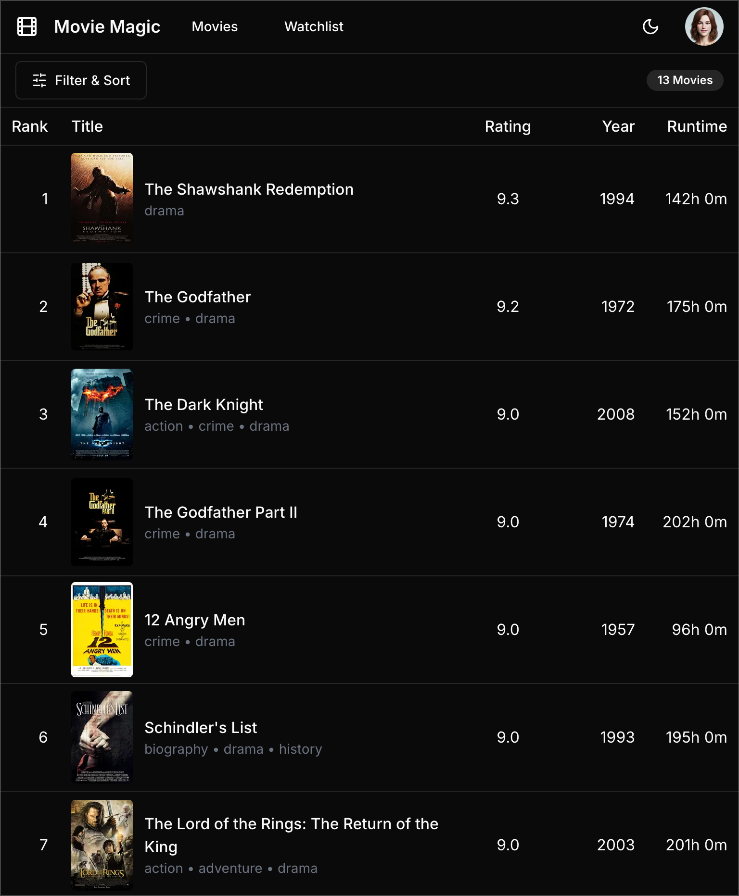

# Movie Magic using Claude

These are my notes from implementing Movie Magic using
[Claude](https://www.anthropic.com/claude), an AI-powered development assistant.

## Table of Contents

- [Claude Artifacts](#claude-artifacts)
- [Development Log](#development-log)
  - [Prompting Claude to Generate Movie Magic](#prompting-claude-to-generate-movie-magic)
  - [Manually Iterating on Claude's Code](#manually-iterating-on-claudes-code)
- [Claude – Overall Impressions](#claude--overall-impressions)
- [Conclusion](#conclusion)

## Claude Artifacts

Before diving into details, it's crucial to introduce an important feature of
Claude called _Artifacts_. Launched in June 2024 as part of Claude 3.5 Sonnet,
artifacts are standalone pieces of content that Claude can share in a separate
window from the main conversation. These can include documents, code snippets,
HTML pages, and React components, providing a powerful tool for developers.
Here's a screenshot from my session with Claude showing an artifact containing a
React component.

A key advantage of artifacts is the ability to iterate on their content
directly. You can ask Claude to modify an artifact, and the updates will appear
in real-time within the artifact window. This feature streamlines the process of
refining and developing ideas or code.

Moreover, Claude can execute certain types of artifacts, offering a preview of
the result. For instance, it can render HTML pages or React Single Page
Applications (SPAs). Below is an example of a Movie Magic landing page created
as a React SPA:

It's worth noting, however, that there are limitations to this feature. Claude
was not able to render my more complex movies page generated as a Next.js app
with multiple components.

## Development Log

### Prompting Claude to Generate Movie Magic

The development process began with a series of prompts to Claude, guiding it
through the creation of the Movie Magic app. Here's a summary of the prompts.
You can review a detailed transcript [here](./claude-chat-transcript.md).
However, note that it is cut off due to Claude's size limitations.

#### Prompt 1 + hand-sketched wireframe

"Give me a detailed description of what's in this wireframe."

Claude demonstrated a thorough understanding of the layout, breaking it down
into four main sections: header, main content, movie list, and movie entry
details.

#### Prompt 2

I then asked Claude to reorganize its breakdown into my preferred structure:

"Modify your breakdown to follow the this structure:

1. Header: ...
2. Toolbar: ...
3. Movie List: ..."

Claude adapted its breakdown accordingly, showcasing its flexibility.

#### Subsequent Prompts

Through a series of follow-up prompts, I refined the requirements:

- Change "Poster placeholder (square)" to "Poster placeholder (aspect ratio of
  2/3)
- Add the following height specifications for each section ...
- Add the following specs for column widths ...
- Change the name of the "Number" column to "Rank". It represents the rank of
  the movie based on audience votes.
- Gap between movie list columns should be 12px. Also the rank column should be
  right justified.
- The default mode for the app should be dark mode
- Using the above breakdown as requirements, implement the Movie Magic app using
  the following tech stack:
  - TypeScript
  - Next.js (be sure to use the App Router, not the old Page Router)
  - Tailwind CSS
  - shadcn/ui

The resulting code was impressively well-structured and modular, demonstrating
Claude's strong grasp of Next.js, Tailwind CSS and shadcn/ui. The generated code
was fairly close to how a human would code.

### Manually Iterating on Claude's Code

After Claude generated the initial codebase, I performed two main iterations:

### Iteration 1: Copy and run Claude's code

I transferred Claude's code to my repository and, after minor cleanup,
successfully ran the app. The result was remarkably close to my manual
implementation:

#### Iteration 2: UI refinement

With some UI cleanup and fine-tuning, I achieved a final implementation that
matched my manual version exactly:

See [this commit]() for the changes involved. Based on the complexity of the
design, and the specificity of my prompts the changes are indeed very
reasonable. This highlights the quality of Claude's initial output.

It's important to note, however, that this achievement primarily addresses the
visual aspects of the application. The functional elements, such as data
fetching from a server and implementing working filters, remain to be developed.
I chose to stop here, as I had already understood Claude's capabilities in
frontend development.

## Claude – Overall Impressions

### The Good

1. **Comprehensive Understanding**: Claude exhibited an impressive ability to
   interpret and break down the hand-sketched wireframe into detailed
   components.

2. **Adaptability**: Claude quickly adapted to changing requirements and
   specifications throughout the development process.

3. **Technical Proficiency**: Claude demonstrated a strong grasp of my preferred
   tech stack, producing well-structured code that closely resembled
   human-written quality.

4. **Modular Code**: The generated code was well-organized and modular,
   enhancing readability and maintainability.

5. **Artifacts Feature**: The ability to generate and iterate on standalone
   content proved to be a powerful feature, streamlining the development
   workflow.

### The Not So Good

1. **Rendering Limitations**: Claude was not able to render the generated Movie
   Magic application due to current limitations. This capability would have
   allowed quicker iterations to arrive at desired outcome faster.

2. **Minor Inaccuracies**: While Claude's implementation was very close to the
   desired outcome, it still required some manual adjustments to perfectly match
   the intended design.

## Conclusion

Claude's ability to rapidly translate a hand-drawn wireframe into a functional
application, with only minor manual adjustments needed, is truly impressive. It
understands both design requirements and technical implementation, producing
code that closely matches human-developed solutions. The artifact feature, in
particular, proves to be a powerful tool for iterative development and
prototyping.

While Claude currently has limitations in rendering complex multi-component
applications, overcoming this constraint would enable even faster iterations and
quicker achievement of desired outcomes. The ideal workflow is to remain in a
single environment from start to finish.
