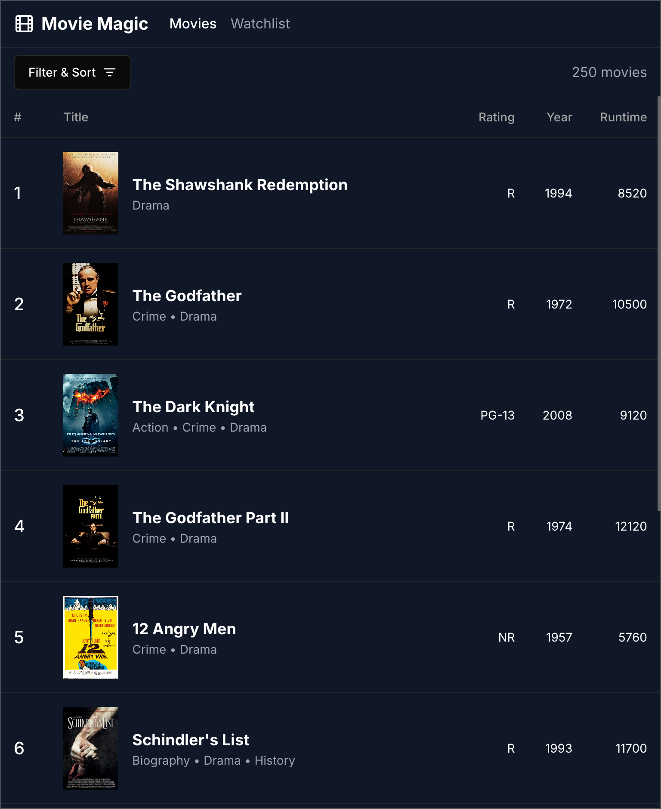

# Movie Magic with Cursor

These are my notes from implementing Movie Magic using
[Cursor](https://www.cursor.com/), an AI-powered development assistant that runs
inside VS Code. It uses Claude 3.5 Sonnet or ChatGPT 4o as the AI backend.

## Table of Contents

- [Development Log](#development-log)
  - [Prompting Cursor to Generate Movie Magic](#prompting-cursor-to-generate-movie-magic)
- [Conclusion](#conclusion)

## Development Log

### Prompting Cursor to Generate Movie Magic

1. Give me a detailed description of what's in this image
2. Modify your breakdown to follow the this structure: Header, Toolbar, Movie
   List
3. Add more details from the image, e.g. heights of the main sections **(Cursor
   added the heights as percentages)**
4. Instead of percentages, use pixel units **(Cursor was able to give
   approximate pixel values that I adjusted later)**
5. Update the MoviesPage component in the current file to implement these
   requirements
6. Change the icon in the Header to the Film icon in lucide-react
7. Change the Filter & Sort button icon to ListFilter icon in lucide-react
8. The nav links in the Header are centered, move them to the left as they are
   in the original image

The session above was less than 30 minutes, but the generated app was already
more polished than any other AI assistant I experimented with.

## Conclusion

The main advantage of Cursor is that it allows me to iterate really fast. I was
even able to make minor tweaks to the code without disrupting the code
generation flow. I could have gone even further to perfect the output, but chose
to stop here. I understood the value prop of Cursor very quickly.
