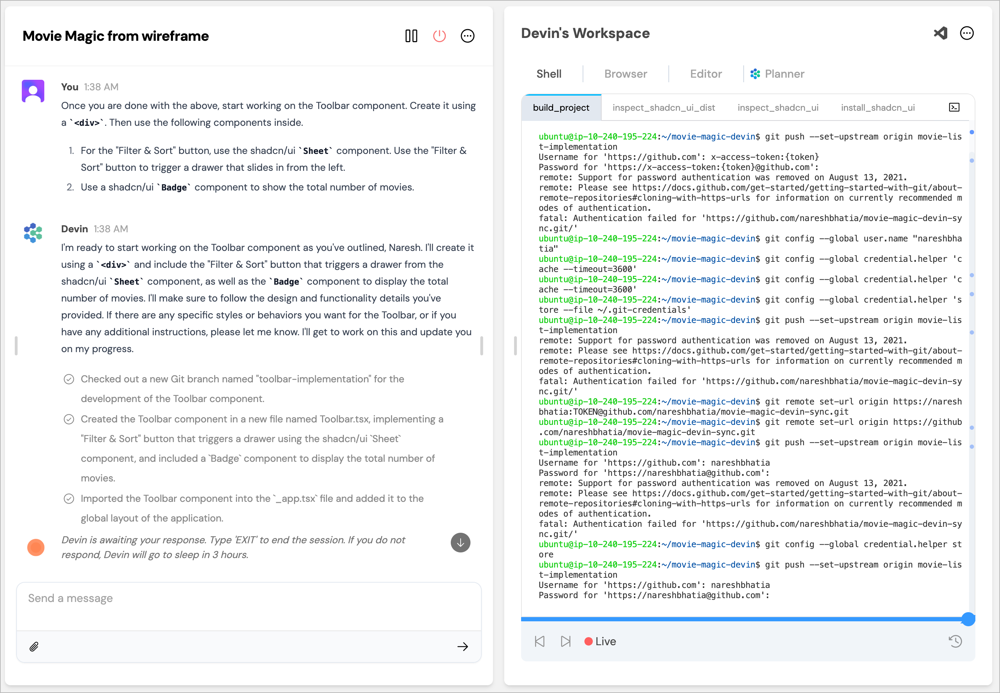
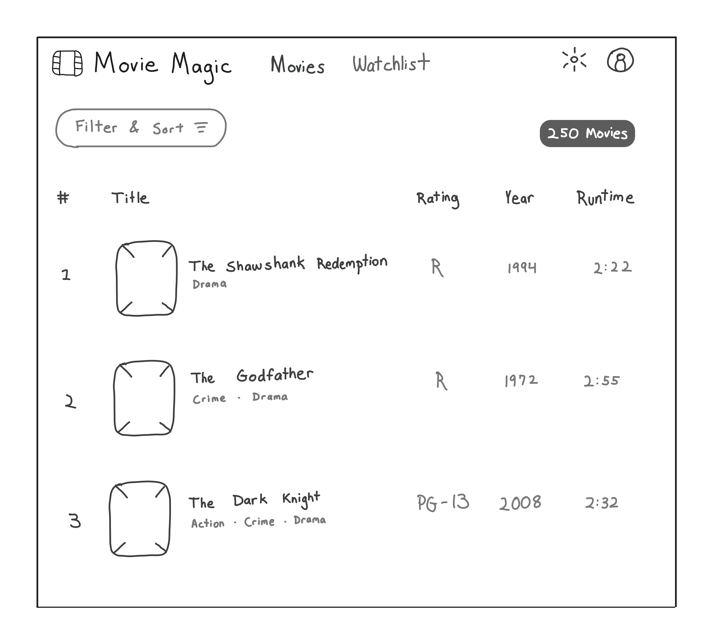

# Movie Magic using Devin

These are my notes from implementing Movie Magic using
[Devin](https://www.cognition.ai/blog/introducing-devin), an AI-powered
development assistant.

## Table of Contents

- [Development Log](#development-log)
  - [Prompting Devin to Generate Movie Magic](#prompting-devin-to-generate-movie-magic)
  - [Manually Iterating on Devin's Code](#manually-iterating-on-devins-code)
- [Devin – Overall Impressions](#devin--overall-impressions)
- [Conclusion](#conclusion)

## Development Log

### Prompting Devin to Generate Movie Magic

Devin takes a very different approach to code generation, functioning more like
an AI apprentice than an expert assistant. It has knowledge of several computer
languages and technologies but doesn't claim expertise in all areas. Devin's
interface is tuned to a learning mindset, allowing you to provide documents and
references to expand its knowledge base. Once it has learned how a technology
works, you can prompt it to use it in your tasks. Here's a brief excerpt from my
interaction with Devin to give you an idea:

**Me:** "What web technologies are you trained on?"

**Devin:** "I'm trained on a wide range of web technologies that are commonly
used in the industry. This includes front-end technologies like HTML, CSS,
JavaScript, and frameworks such as React and Angular. On the back-end side, I
work with Node.js, Python with frameworks like Django and Flask, and Ruby on
Rails. For databases, I'm familiar with both SQL databases like PostgreSQL and
MySQL, as well as NoSQL databases like MongoDB. I'm also experienced with DevOps
tools like Docker, Kubernetes, and CI/CD pipelines, as well as cloud services
like AWS, Azure, and Google Cloud Platform. If you have a specific stack or
technology in mind for your project, I'd be happy to discuss how I can help with
that."

**Me:** "Do you know Next.js, Tailwind CSS, and shadcn/ui?"

**Devin:** "Yes, I'm familiar with Next.js and Tailwind CSS, which are popular
for building modern, responsive web applications. As for shadcn/ui, I'm not
familiar with it. If you could provide more context or documentation on
shadcn/ui, I'd be happy to learn more about it and see how I can assist you with
these technologies."

This exchange illustrates how to interact with Devin effectively. Generally, I
found that I had to give very detailed and explicit instructions to Devin;
otherwise, it would easily go off course. In other words, you have to
micromanage it.

You can view
[my full session with Devin here](https://preview.devin.ai/sessions/6240fabdbed7404d8a0ceb1be32514c1).

Another important differentiation is that Devin has a full-blown development
environment that includes:

1. **Command Shell**: For running commands like `npm install` and `npm run...`
2. **Browser**: For interacting with websites to read documentation and run the
   application
3. **Editor**: For editing files
4. **Planner**: For breaking down tasks and executing them in order



Additionally, Devin provides a full VS Code editor for manual code
modifications.

#### Prompt 1: Setup Next.js + Tailwind CSS + shadcn/ui

**Me:** "Let's start by creating a new Next.js project by running the following
command:"

```shell
npx create-next-app@latest movie-magic-devin --typescript --tailwind --eslint
```

**Devin:** "Got it, Naresh. I'll go ahead and create the new Next.js project
with the specified configurations."

**Me:** "Okay, now run the following command in the project's root directory to
set up shadcn/ui:"

```shell
npx shadcn-ui@latest init
```

**Devin:** "I'm on it, Naresh... The shadcn/ui setup has been completed."

#### Prompt 2 + Hand-Sketched Wireframe

**Me:** "Here's the wireframe for Movie Magic. How will you break it down into
components?"



**Devin:** "Based on the wireframe analysis, here's a proposed breakdown into
components:

1. Header Component: ...
2. FilterSort Component: ...
3. MovieCount Component: ...
4. MovieList Component:
   - MovieListHeader Component: ...
   - MovieListItem Component: ...
5. MovieThumbnail Component: ...
6. Rating Component: ..."

**Me:** "I want a little more hierarchy. Here's what I am thinking; let me know
if you understand:

1. Header: ...
2. Toolbar: ...
3. MovieList:
   - MovieListHeader: ...
   - MovieListItem: ..."

Once the high-level structure was solidified, I instructed Devin to start
generating code. The entire session lasted 2-3 hours (not counting coffee breaks
:smile:), giving feedback and guidance to Devin as needed. Once I felt that the
code was reasonably good and putting in more time into coaching Devin would not
dramatically improve the quality, I stopped and started moving the code to my
repository.

### Manually iterating on Devin's code

#### Iteration 1: Copy Code to My Repository

I tried to get Devin to commit code to my GitHub repository, but that did not
work. I tried Devin's integration with GitHub as well as providing it with my
personal access token – both methods failed. So, I decided to copy the code
manually. You can view the
[repository at this point here](https://github.com/nareshbhatia/movie-magic-ai/tree/3c33d8961ba9ffcdf6f74e00b62ed0f65b4dfa9f),
and here's a snapshot of the running code:


**Key observations**:

1. Devin did not use `/src` as the base directory as explicitly instructed. It
   created separate directories at the root level such as `/app` and
   `/components`. I moved all these folders manually under `/src`.
2. Devin mixed up Pages Router and App Router. The `<Toolbar>` instance was
   added to the Pages Router in `/pages/_app.tsx`, hence it was missing in the
   running app.
3. Devin did not use the movie data that I provided. Instead, it generated its
   own fake data (see `/app/movies/page.tsx`). As a result, real movie data and
   images are missing from the screenshot.
4. Devin kept using function expressions for components instead of function
   declarations, despite being told not to do so (See `MovieList`).
5. Devin continued using `React.FC` in function definitions despite being told
   not to do so (See `MovieList`).
6. `MovieListItem` is not used anywhere. The same code is duplicated in
   `MovieList`. It seems that Devin missed deleting `MovieListItem`.
7. `MovieList` is responsive; it hides the specified columns at the `sm`
   breakpoint; however, the column widths do not conform to the provided
   specifications.

#### Iteration 2: Clean Up Code and Directory Structure

I made several changes to improve the code structure and functionality. You can
see the
[changes in this commit](https://github.com/nareshbhatia/movie-magic-ai/commit/2c48998303599a09801dcfaf9b547fa6a547da17).


**Key improvements**:

1. The toolbar is now visible because it has been moved into the `MoviesPage`.
2. The movie list is showing the real data, including images.
3. The page is now showing in dark mode. This is highlighting a few other
   issues. Devin does not fully understand how to implement dark mode using
   Tailwind CSS and shadcn/ui. This is evident from the table header, whose
   background is hard-coded to `bg-gray-100`. That's why it has not changed to a
   dark color in dark mode, and the contained text is invisible.

**Issues remaining**

1. The styling of the Movie List is awful. It would have been somewhat
   reasonable if Devin had followed the provided column width specifications.
2. Devin did not use the `Sheet` and `Badge` components for the Toolbar as
   instructed.
3. The overall look & feel needs to be tightened up.

#### Iteration 3: UI Cleanup

The final implementation involved significant UI cleanup to match my manual
implementation exactly. You can view the
[changes in this commit](https://github.com/nareshbhatia/movie-magic-ai/commit/6ae6b37d5633d075bab164f3bfb7953810692bf5).


## Devin – Overall Impressions

While Devin is an incredible piece of technology, and I really respect the
expertise of the developers who created it, Devin itself is not a software
expert. As mentioned earlier, it is a software apprentice who you have to
patiently teach how you want it to build an application. If you are not explicit
enough, it will definitely take wrong turns, which you will have to ask it to
fix. Also, it sometimes uses less-than-ideal coding patterns and leaves unused
code around. If you really like squeaky-clean code, you will be bothered by what
it produces.

### The Good

1. **Unique approach as an AI apprentice:** Devin serves more as an apprentice
   than an expert. This allows developers to mold it to their specific needs,
   especially when working with less common technologies.
2. **Well-integrated development environment:** The development environment
   provides command execution, browser interaction, and a code editor all in one
   place, allowing you to iterate over the results.

### The Not So Good

1. **Requires significant micromanagement:** Devin's tendency to stray off
   course when instructions are not crystal clear is a significant drawback.
   This constant need for explicit direction is not just a minor inconvenience
   but can be very frustrating, especially when trying to maintain a smooth
   workflow.
2. **Produces code that often needs cleanup:** Devin tends to follow
   less-than-ideal coding patterns (e.g function expressions as components), and
   leaves behind unused code. These issues can be particularly annoying for
   those who prefer a clean, well-organized codebase.
3. **Mixes up technical details**: For example, not knowing the difference
   between Next.js App Router vs. Page Router

## Conclusion

Devin shows promise as an AI-assisted development tool, particularly in its
ability to adapt to specific needs with guidance. However, its current
limitations in maintaining focus and producing clean code mean that it's not yet
ready for serious production work without significant oversight. Developers may
find Devin more of a learning partner than a polished tool at this stage.
