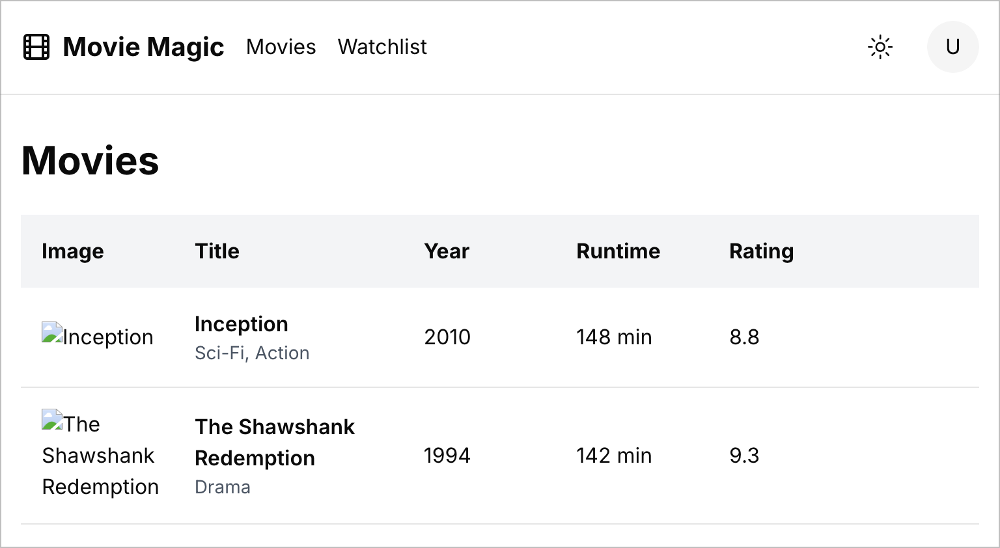
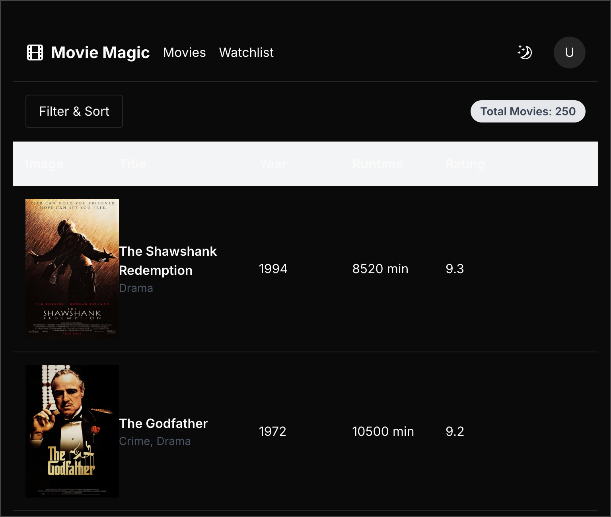
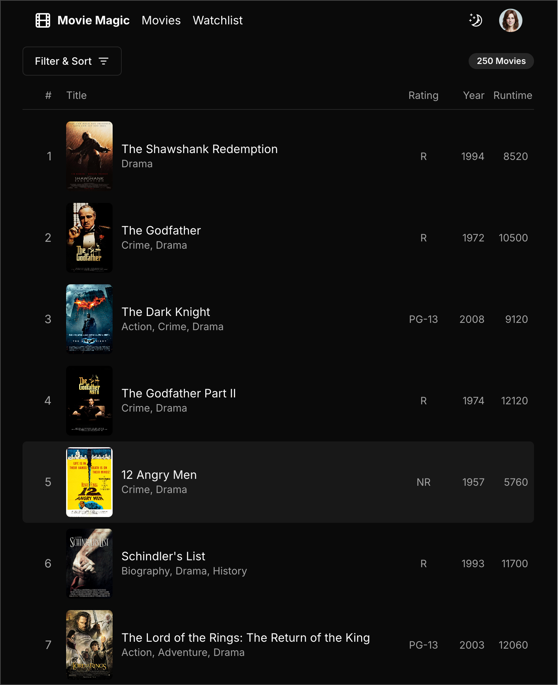

# Movie Magic Devin

These are my notes from implementing Movie Magic using
[Devin](https://www.cognition.ai/blog/introducing-devin).

## Development Log

### Create version 1 in Devin's environment

Here's a link to
[my session with Devin](https://preview.devin.ai/sessions/6240fabdbed7404d8a0ceb1be32514c1).

### Iterate on Devin generated code manually

#### Iteration 1: Copy code to my repository

I tried to get Devin to commit code to my GitHub repository, but that did not
work (tried Devin's integration with GitHub as well as providing it with my
personal access token – both did not work). So I decided to copy the code
manually. Here's the
[repository at this point](https://github.com/nareshbhatia/movie-magic-ai/tree/3c33d8961ba9ffcdf6f74e00b62ed0f65b4dfa9f),
and here's a snapshot of the running code:

**Key observations**:

1. Devin did not use `/src` as the base directory as explicitly instructed. It
   created separate directories at the root level such as `/app` and
   `/components`. I moved all these folders manually under `/src`.
2. Devin mixed up Pages Router and App Router. The `<Toolbar>` instance was
   added to the Pages Router in `/pages/_app.tsx`, hence it was missing in the
   running app.
3. Devin did not use the movies data that I provided. Instead it generated its
   own fake data (see `/app/movies/page.tsx`). As a result, real movie data and
   images are missing from the screenshot.
4. Devin kept on using function expressions for components instead of function
   declarations in spite of telling it not to do so (See `MovieList`).
5. Devin kept on using `React.FC` in function definitions in spite of telling it
   not to do so (See `MovieList`).
6. `MovieListItem` component is not used anywhere. That same code is duplicated
   in `MovieList`. It seems that Devin missed deleting `MovieListItem`.
7. `MovieList` is responsive, it hides the specified columns at the `sm`
   breakpoint, however the column widths do not conform to the provided specs.

#### Iteration 2: Clean up code and directory structure

See
[this commit](https://github.com/nareshbhatia/movie-magic-ai/commit/2c48998303599a09801dcfaf9b547fa6a547da17)
to get a feel for the changes.

**Key observations**:

1. Toolbar is now visible because it has been moved into the `MoviesPage`.
2. The movie list is showing the real data, including images.
3. Styling of the Movie List is awful. It would have been somewhat reasonable if
   Devin had followed the provided column width specifications.
4. Page is now showing in dark mode. This is highlighting a few other issues.
   Devin does not really understand how to implement dark mode using Tailwind
   CSS and shadcn/ui. This is evident from the table header, whose background is
   hard-coded to `bg-gray-100`. That's why it has not changed to a dark color in
   dark mode and the contained text is invisible.
5. Devin did not use the `Sheet` and `Badge` components for the Toolbar as
   instructed.

#### Iteration 3: UI cleanup

Here's the final implementation after a bunch of UI cleanup, tightening up the
look & feel. See [this commit]().

This now matches my manual implementation exactly. However it took a lot of
effort to get to this point.
