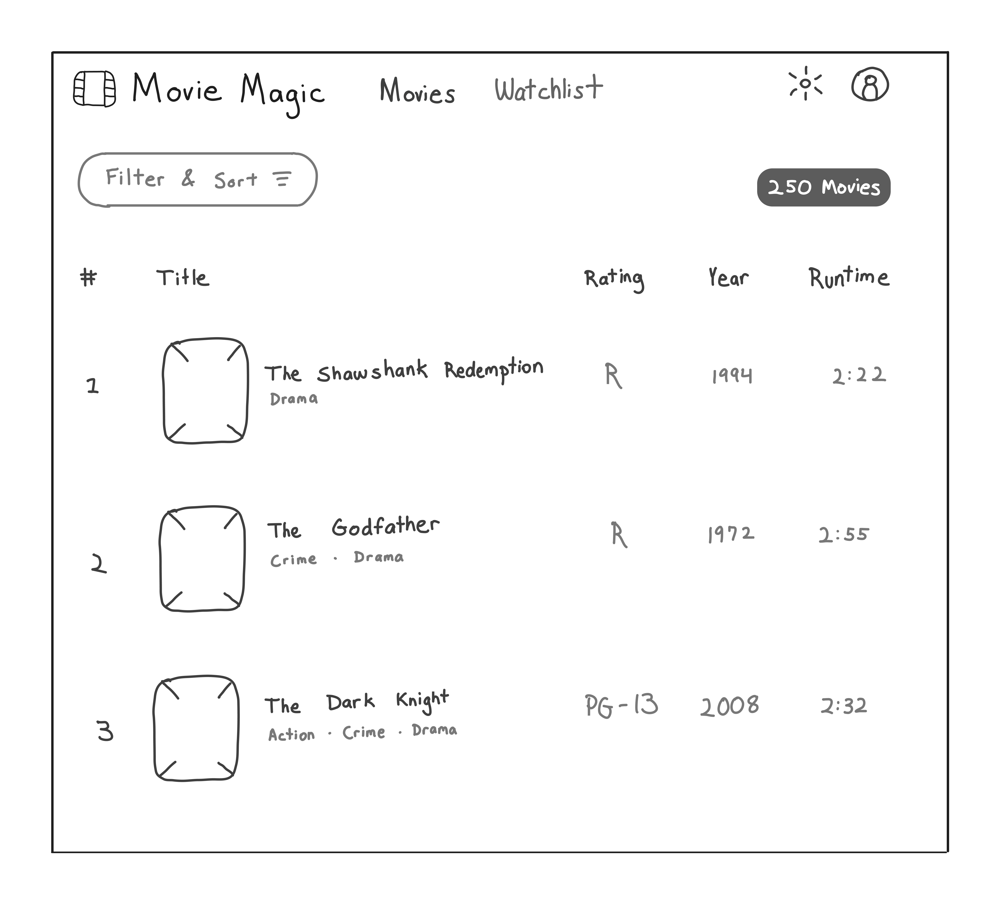

# Movie Magic using Vercel's v0

These are my notes from implementing Movie Magic using
[Vercel's v0](https://v0.dev).

## Development Log

### Create version 0 in Vercel's v0 environment

#### Prompt 0 + hand-sketched wireframe

"A movie streaming application called Movie Magic that allows the user to browse
and filter movies so they can add them to their watchlist."



v0 created a very good first implementation of the wireframe using Tailwind CSS
and shadcn/ui.


Here are some highlights:

- The application logo was spot on (film icon)
- The mode toggle and user icons were spot on, though non-functional
- Filter & Sort button was picked up correctly, though the icon did not match
- Total Movies badge was spot on, using the shadcn/ui `<Badge>` component
- The Movie List was formatted correctly, using the shadcn/ui `<Table>`
  component. The movie rows were coded as repeated, hard-coded `<TableRow>`
  elements. I would have preferred a loop driven by an array, but this was
  already pretty good.

#### Prompt 1

"Change the filter icon to ListFilter from lucide icons"

v0 was able to pick up the right icon.

#### Prompt 2

"Allow toggle button to switch between light and dark mode"

This did not work well. While the light mode remained unchanged, the dark mode
did not change the background to dark. Some text did change from black to white,
but in the process became invisible because the background was also white. The
implementation did not use `next-themes` as suggested in shadcn/ui docs. I
decided to leave this alone and make it work when I bring the code into my
repository.

#### Prompt 3

"Convert the mode toggle button into a dropdown menu with three items: Light,
Dark and System"

v0 faithfully did this, using the shadcn/ui `<DropdownMenu>` component.

#### Prompt 4

"Convert the Avatar into a Dropdown menu. First menu item is a menu label with
user's name & email, followed by a divider, and lastly a "Sign Out" button."

v0 carried out these instructions perfectly.

#### Prompt 5

"Convert the Filter & Sort button into a Sheet that pulls out a drawer from the
left side when clicked"

Again, flawless execution! v0 used the shadcn/ui `<Sheet>` component to pull out
a drawer when the button was clicked. It also put some meaningful filters in the
drawer panel.

#### Prompt 6

"In mobile form factor collapse the icon, application title and navigation links
into a drawer that is triggered by a hamburger menu"

v0 picked up these instructions remarkably well, collapsing the listed items
into a hamburger menu. Only issue was it did it for all form factors!

#### Prompt 7

"The collapsed hamburger menu should only appear in mobile mode. In tablet and
desktop mode the full application header should appear"

v0 did not this very well. It used the collapse menu for mobile as well as
tablet mode. Only the desktop mode had the full menu. Moreover, it moved the
Mode Toggle and the Avatar dropdown to the left corner. Let's see if we can fix
this.

#### Prompt 8

"Theme toggle and Avatar dropdown should always be in the right corner"

v0 followed the above instructions, but now dragged the hamburger icon to the
right too. Not good! I will fix this later manually.

#### Prompt 9

"In mobile mode, only show the movie image, title and genres. Hide the rank,
rating, year and runtime"

v0 executed this perfectly!

#### Prompt 10

"Improve the styling of the Movie table based on the following specifications:

1. Rank: 32px wide, right justified
2. Title: Fill the remaining space after accounting for all other columns
3. Rating: 48px wide, centered text
4. Release Year: 48px wide, right justified
5. Runtime: 48px wide, right justified"

v0 executed this perfectly – no complains!

#### Prompt 11

"Make one of the movie titles really long"

This was to see how it handled long titles. Turns out that it wraps them, which
increases the row height for really long titles. This looks especially bad in
mobile form factors. Let's try to fix this.

#### Prompt 12

"The movie title should not wrap when it is too long to fit in the column."

v0 followed the instruction correctly. It stopped wrapping the titles and
truncated the really long ones. However the truncation alone didn't look very
good, so I asked it to show ellipses at the end of truncated titles. v0 was not
able to do this after several attempts. So I decided to drop the `<Table>`
implementation in favour of straight `<div>`s + Flexbox. This will give me more
control over the layout.

#### Prompt 13

"Replace table with <div>s using flexbox. Make sure to replicate all column
specs. All columns should have fixed widths, except for the Title colum which
should expand to fill the remaining space."

v0 followed the instructions fairly accurately, though it missed putting gaps
between the columns. When I asked it to put gaps, it added `margin-right` on
each column, which is also not very good. I prefer controlling the gap in flex
layouts using Tailwind's `gap` classes. That is exactly what I did. This is the
only time I went into the v0 editor to change the code manually!

While I was at it, I also changed the Movie List to be array driven, eliminating
the repeated markup for each row.

At this point, I had a pretty good version 0 and it was time to bring the code
into my Movie Magic repository. Here's the final implementation generated by v0:


### Iterate on v0 generated code manually

#### Iteration 1: Clean up v0 generated code

Given that the v0 code is runnable, it's a great start. However, that code is
JavaScript (in .js & .jsx files), not strictly typed. My Code Shaper templates
require very tight type checking + linting (see the Code Shaper ESLint
configuration
[here](https://github.com/code-shaper/code-shaper/tree/main/configs/eslint-config)),
so I had to clean up the v0 code a bit. For example, the following function
declaration gave a TypeScript error ("Parameter 'props' implicitly has an 'any'
type"), which had to be fixed.

```tsx
function FilmIcon(props) {
  ...
}
```

#### Iteration 2: Split the code into manageable components

v0 generates all of the UI code in a single file called `component.jsx`. This is
obviously not very manageable for for complex screens. So the first thing I did
was to split this file into smaller logical pieces – no functional changes.

#### Iteration 3: Implement dark mode


#### Iteration 4: UI cleanup

Here's the final implementation after some UI cleanup, tightening up the look &
feel. See
[this commit](https://github.com/nareshbhatia/movie-magic-ai/commit/f37434c8003837decaf3657fbc7949f05e7d2693)
for the effort involved.


This now matches my manual implementation exactly, wow! Very happy with v0 so
far. Of course, this gets us only the visual look. The functionality is still
missing, such as fetching data from a server and the filters not working. I
stopped here with v0 because I had a good idea of its capabilities.

## v0 – Overall Impressions

### The Good

1. **Deep Understanding of a Single Tech Stack:** v0 excels in targeting React,
   Tailwind CSS, and shadcn/ui, particularly in its initial implementation. It
   has a deep understanding of this tech stack and effectively utilizes
   shadcn/ui components to handle complex use cases. For instance, it can
   implement features like opening a side drawer when a button is clicked using
   the `<Sheet>` component.

2. **Ability to Build and Run Generated Code:** One of v0's most significant
   advantages is its capability to not only generate code but also compile and
   run it. This assures that the code is functional right out of the box. If the
   results are unsatisfactory, you can provide feedback, and v0 will promptly
   attempt to correct the issue. This eliminates the need to copy-paste the code
   into your repository just to test it, making iteration on your requirements
   incredibly fast.

3. **Component Breakdown:** v0 demonstrates impressive skill in analyzing a
   wireframe and decomposing it into the appropriate layout. It also does a
   commendable job of ensuring the layout is responsive. The main drawback here
   is that the entire layout is created in a single file (more on this later).

4. **Targeted Prompts:** v0 allows you to focus your prompts on specific
   elements within the generated UI, offering a high level of precision in your
   interactions.

5. **Ability to Edit Code Directly Within v0:** If v0 doesn't fully follow your
   instructions, you can take control and modify the code as you see fit. You'll
   see the results instantly, allowing you to quickly determine if the changes
   had the desired effect.

6. **Good Setup Instructions:** Once you've reached a point where further
   prompts are no longer yielding better results, it's time to integrate the
   generated code into your repository. v0 provides clear instructions for this
   process, including a CLI that imports the code directly into your repository.
   In my case, I chose to bypass v0's setup instructions, relying instead on my
   Code Shaper templates to configure my preferred tech stack and toolchain. I
   simply copy-pasted the `component.jsx` file generated by v0.

### The Not So Good

1. **Monolithic Code:** v0 generates the entire UI in a single file called
   `component.jsx`. While this approach may work for simpler interfaces, it
   becomes unmanageable for more complex ones. Even for the relatively simple
   Movie Magic screen, I had to manually decompose the generated code into three
   main components (`<Header>`, `<Toolbar>`, and `<MovieList>`) and further into
   sub-components.

2. **Does Not Run in My IDE:** Although iterating within the v0 environment is
   quick, once the code is transferred to your IDE, there's no way to continue
   using v0. While this isn't an issue during the initial stages due to v0's
   strengths, it would be ideal if v0 could be integrated directly into my IDE,
   perhaps as a VS Code plugin.

3. **Not TypeScript:** The generated code is in JavaScript, which required some
   effort to adapt for TypeScript compatibility.

4. **Understanding Feedback:** While v0 generally understands prompts well,
   there were instances where it misinterpreted them. For example, when I
   requested that navigation links collapse under a hamburger menu for mobile
   devices only, it applied this change to all form factors.

5. **Flaky Light/Dark Mode Implementation:** Given v0's strong understanding of
   Tailwind CSS and shadcn/ui, I expected a flawless implementation of
   light/dark mode. Unfortunately, this was not the case, and I had to make
   adjustments manually. However, this issue is relatively minor in the grand
   scheme of things.

## Conclusion

v0 shows great promise as a tool for generating code from wireframes, especially
for those working within a specific tech stack like React, Tailwind CSS, and
shadcn/ui. Its ability to generate functional code and allow for immediate
iteration is a significant strength. While there are areas that could be
improved, such as breaking down monolithic code and better IDE integration, v0
already provides a solid foundation for rapid prototyping and development.

As v0 continues to evolve, it holds tremendous promise to become an even more
versatile and user-friendly tool for developers. Its potential to streamline
complex interfaces and simplify the development process makes it an exciting
tool to watch as it matures.
